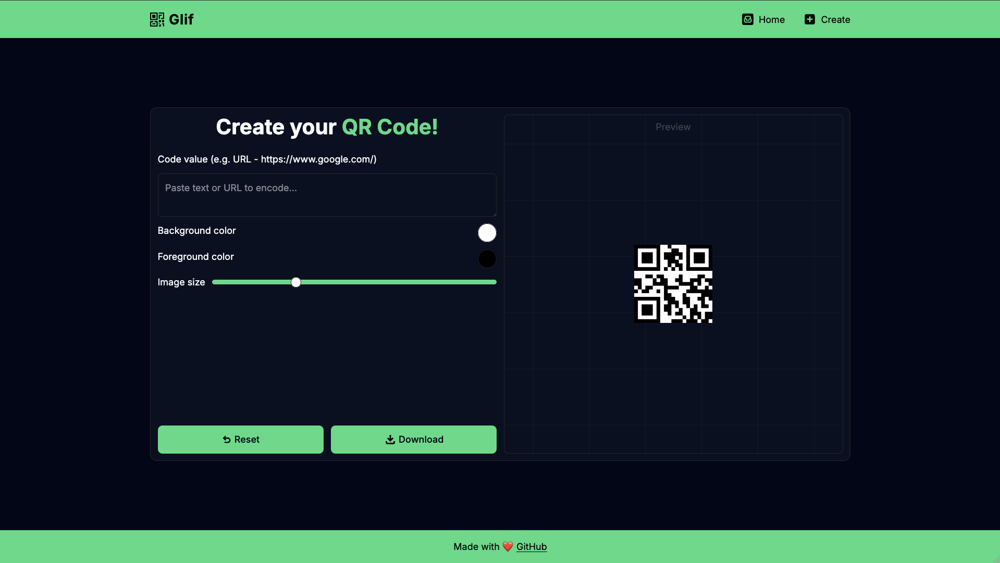

# Glif - QR Code Generator
<!-- ALL-CONTRIBUTORS-BADGE:START - Do not remove or modify this section -->

<!-- ALL-CONTRIBUTORS-BADGE:END -->

## Description

Glif is a small web application that allows you to create and download customizable QR codes.

## Key Features

- Generate QR codes from text or URLs
- Customize size and foreground/background colors
- Download the QR code as a PNG image

## Tech Stack

- Nuxt
- TypeScript
- TailwindCSS
- [qrcode.vue](https://github.com/scopewu/qrcode.vue) for QR rendering

## Requirements

- Node.js (recommended v16+ or v18+)
- npm or yarn

## Contributing

All instructions can be found in the [CONTRIBUTING.md](CONTRIBUTING.md) file.

## Support

If you like this project, you can support me with a very small donation.

I would be grateful 🥹
 
 

## Contributors ✨

Thanks goes to these wonderful people ([emoji key](https://allcontributors.org/docs/en/emoji-key)):

<!-- ALL-CONTRIBUTORS-LIST:START - Do not remove or modify this section -->
<!-- prettier-ignore-start -->
<!-- markdownlint-disable -->
<table>
  <tbody>
    <tr>
      <td align="center" valign="top" width="14.28%"><a href="http://notbyte.com"> <b>botprzemek</b></a> <a href="https://github.com/DomeT99/glif/commits?author=botprzemek" title="Code">💻</a></td>
      <td align="center" valign="top" width="14.28%"><a href="http://linktr.ee/domenicotenace"> <b>Domenico Tenace</b></a> <a href="https://github.com/DomeT99/glif/commits?author=DomeT99" title="Code">💻</a> <a href="#projectManagement-DomeT99" title="Project Management">📆</a> <a href="#maintenance-DomeT99" title="Maintenance">🚧</a></td>
    </tr>
  </tbody>
</table>

<!-- markdownlint-restore -->
<!-- prettier-ignore-end -->

<!-- ALL-CONTRIBUTORS-LIST:END -->

This project follows the [all-contributors](https://github.com/all-contributors/all-contributors) specification. Contributions of any kind welcome!